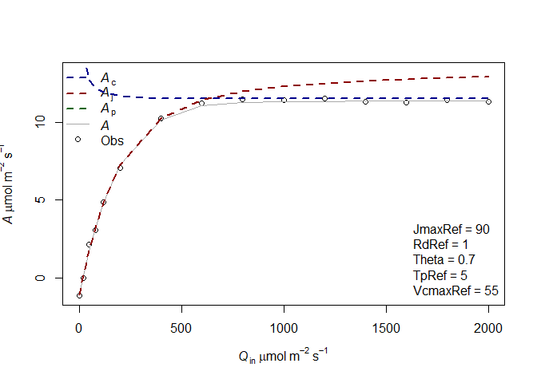
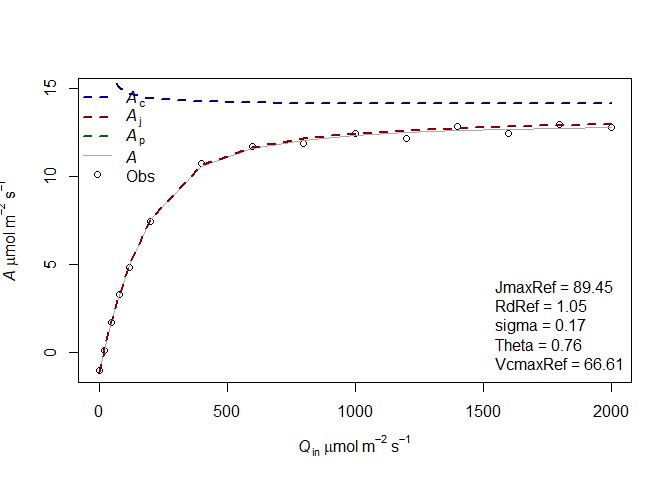
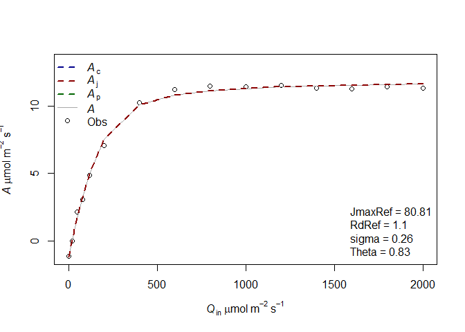

# Load the R libraries

    library(LeafGasExchange)
    library(mvtnorm)

# Fitting an AQ curve

The objective of this tutorial is to illustrate how to fit an A-Q curve
using the “LeafGasExchange” package. In this tutorial, we first simulate
an A-Q curve with known photosynthetic parameters and noise. This curve
is then fitted to retrieve the parameters.

## Simulating an AQ curve

For this example we first simulate a photosynthesis curve, but it would
work the same if the data was not simulated but measured. The data
simulation is done using the function f.A. This function needs a list of
photosynthetic parameters which are produced using the function
f.make.param() and a list of input variables (CO2 at the surface of the
leaf, leaf temperature, incident light, RH). To have more information on
the function f.make.param, you can use the command ?f.make.param in R
console. Theta corresponds to the empirical curvature factor and abso
corresponds to the leaf absorptance.

    param=f.make.param(VcmaxRef = 70,JmaxRef=90,Theta=0.7,abso=0.9,TpRef=50/10,RdRef=1)
    CO2=400
    Tleaf=30+273.16
    Tair=27+273.16
    PAR=c(0,20,50,80,120,200,400,600,800,1000,1200,1400,1600,1800,2000)
    RH=70
    simul=f.A(PFD = PAR,cs = CO2,Tleaf = Tleaf,Tair = Tair,RH = RH,param = param)

    # Here we include a normal error 

    simul$A=simul$A+rnorm(n=length(simul$A),mean = 0,sd = 0.3)
    measures=data.frame(Tleaf=Tleaf,Ci=simul$ci,Qin=PAR,A=simul$A)

We display this simulated curve using the function f.plot

    f.plot(measures = measures,type = 'Aq',list_legend = param[c('VcmaxRef','JmaxRef','TpRef','RdRef','Theta')],param = param)

In this case, you see that the top Assimilation values are only limited
by Aj. It is thought that at high light in usual environmental
conditions, Ac and Aj have similar rates. This coordination is thought
to be often present in plants. In other cases Ac can be limiting at high
light.

For example:

    param2=f.make.param(VcmaxRef = 55,JmaxRef=90,Theta=0.7,abso=0.9,TpRef=5,RdRef=1)
    simul2=f.A(PFD = PAR,cs = CO2,Tleaf = Tleaf,Tair = Tair,RH = RH,param = param2)

    # Here we include a normal error 

    simul2$A=simul2$A+rnorm(n=length(simul2$A),mean = 0,sd = 0.3)
    measures2=data.frame(Tleaf=Tleaf,Ci=simul2$ci,Qin=PAR,A=simul2$A)
    f.plot(measures = measures2,type = 'Aq',list_legend = param2[c('VcmaxRef','JmaxRef','TpRef','RdRef','Theta')],param = param2)

## Fitting an AQ curve

To fit an AQ curve, it is necessary to detail the parameter that we want
to estimate. All the parameters present in f.make.param can potentially
be fitted even if it would not always make sense. We do a first fitting
with only the parameters JmaxRef, Theta and RdRef. Those parameters have
to be given in the list Start, with initial values. The method will look
for different initial values around those values so it is not necessary
to give very good ones, just not too stupid ones. The photosynthetic
parameters have to be given in the list param. This is used to determine
what should be the parameters for the temperature dependence, for the
leaf absorbance, theta, etc. By default, the equations and parameters
used in the TBM FATES to simulate the photosynthesis are used. In this
example, we also give a high value for VcmaxRef so it is not limiting
the photosynthesis rates. We’ll revisit this assumption later.

    fitting1=f.fitting(measures = measures,Start = list(JmaxRef = 60, RdRef = 1,Theta=0.5),param=f.make.param(abso=0.9,VcmaxRef=9999),
                       modify.init=TRUE,do.plot=TRUE,type='Aq')

    ## $par
    ##    JmaxRef      RdRef      Theta 
    ## 89.9712392  1.1241761  0.7562085 
    ## 
    ## $value
    ## [1] 1.137301
    ## 
    ## $counts
    ## function gradient 
    ##      110       NA 
    ## 
    ## $convergence
    ## [1] 0
    ## 
    ## $message
    ## NULL
    ## 
    ## [1] "sd 0.275354423673918"
    ## Length  Class   Mode 
    ##      1   mle2     S4

In a second example we now also (try to) fit VcmaxRef. Here the fitting
gives a weird value for VcmaxRef which is very high as there is no
information in the curve to estimate it.

    fitting2=f.fitting(measures = measures,Start = list(JmaxRef = 30,VcmaxRef=40, RdRef = 1,Theta=0.5),param=f.make.param(abso=0.9),
                       modify.init=TRUE,do.plot=TRUE,type='Aq')

    ## $par
    ##   JmaxRef  VcmaxRef     RdRef     Theta 
    ## 93.295444 62.617218  1.090212  0.710990 
    ## 
    ## $value
    ## [1] 1.079666
    ## 
    ## $counts
    ## function gradient 
    ##      425       NA 
    ## 
    ## $convergence
    ## [1] 0
    ## 
    ## $message
    ## NULL
    ## 
    ## [1] "sd 0.268286688021414"
    ## Length  Class   Mode 
    ##      1   mle2     S4

The fitting returns a list of 3 objects. The first object corresponds to
the fitting using a minimum square function whereas the second object
corresponds to a maximum likelihood derived using the mle2 package. This
latter method is useful because it allows us to calculate the confidence
interval of the parameters.

The third object correspond to the mean environmental values present in
the input data file of the function (see the help of f.fitting for more
info).

    confint(fitting1[[2]])

    ##              2.5 %     97.5 %
    ## sigma    0.2001556  0.4133620
    ## JmaxRef 87.5057929 92.5227812
    ## RdRef    0.8591327  1.3861695
    ## Theta    0.6657821  0.8270025

It is possible to compare the AIC of the two models using the base
function AIC or BIC. The lower AIC or BIC corresponds to the best model.
It shows in this case that adding VcmaxRef is not usefull.

    BIC(fitting1[[2]])

    ## [1] 9.422447

    BIC(fitting2[[2]])

    ## [1] 10.02865

We can redo this procedure for the second simulated curve:

    fitting3=f.fitting(measures = measures2,Start = list(JmaxRef = 30, RdRef = 1,Theta=0.5),param=f.make.param(abso=0.9,VcmaxRef=150),
                       modify.init=TRUE,do.plot=TRUE,type='Aq')

    ## $par
    ##    JmaxRef      RdRef      Theta 
    ## 80.4394879  1.0774293  0.8045951 
    ## 
    ## $value
    ## [1] 1.080278
    ## 
    ## $counts
    ## function gradient 
    ##      106       NA 
    ## 
    ## $convergence
    ## [1] 0
    ## 
    ## $message
    ## NULL
    ## 
    ## [1] "sd 0.268362699108731"
    ## Length  Class   Mode 
    ##      1   mle2     S4

    fitting4=f.fitting(measures = measures2,Start = list(JmaxRef = 30, RdRef = 1,Theta=0.5,VcmaxRef=30),param=f.make.param(abso=0.9),
                       modify.init=TRUE,do.plot=TRUE,type='Aq')

    ## $par
    ##    JmaxRef      RdRef      Theta   VcmaxRef 
    ## 89.0847230  0.9900322  0.6818325 54.7903712 
    ## 
    ## $value
    ## [1] 0.7971008
    ## 
    ## $counts
    ## function gradient 
    ##      483       NA 
    ## 
    ## $convergence
    ## [1] 0
    ## 
    ## $message
    ## NULL
    ## 
    ## [1] "sd 0.230521271470263"
    ## Length  Class   Mode 
    ##      1   mle2     S4

As previously we can compare the fitting with or without VcmaxRef as a
parameter to estimate:

    BIC(fitting3[[2]])

    ## [1] 8.650857

    BIC(fitting4[[2]])

    ## [1] 5.477261

In this case, the model with VcmaxRef is better.

Generally it is interesting to test the fitting with or without
VcmaxRef, and sometimes with or without Theta. Note that Theta can be
difficult to estimate and can also reach negative values (June, 2005).

Note also that the parameters from the light curves (VcmaxRef and
JmaxRef notably) are rarely used in modeling and that the estimation of
those parameters is generally done using A-Ci curves.

June, T. (2005). The light gradients inside soybean leaves and their
effect on the curvature factor of the light response curves of
photosynthesis. BIOTROPIA-The Southeast Asian Journal of Tropical
Biology, (25).
